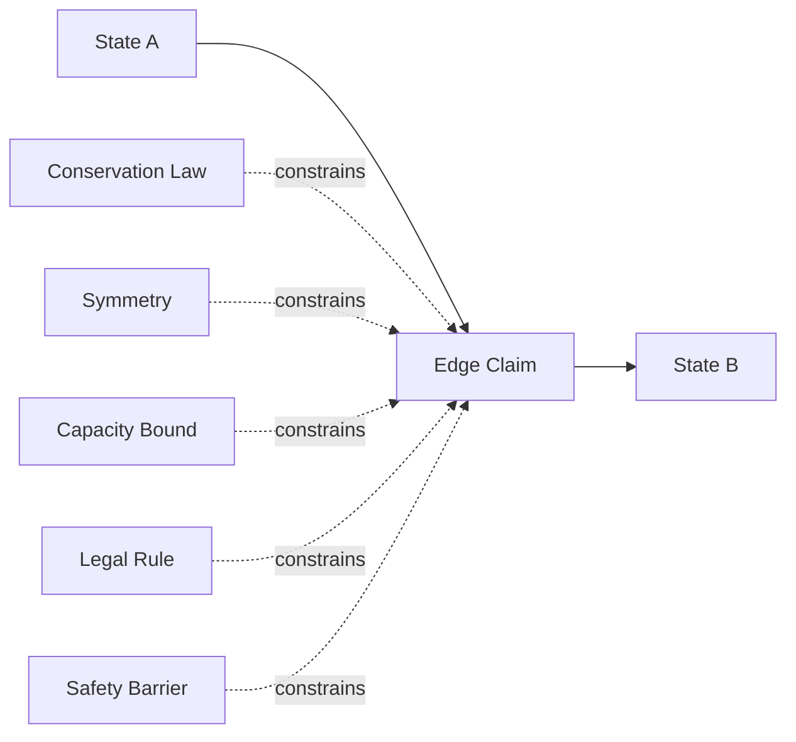
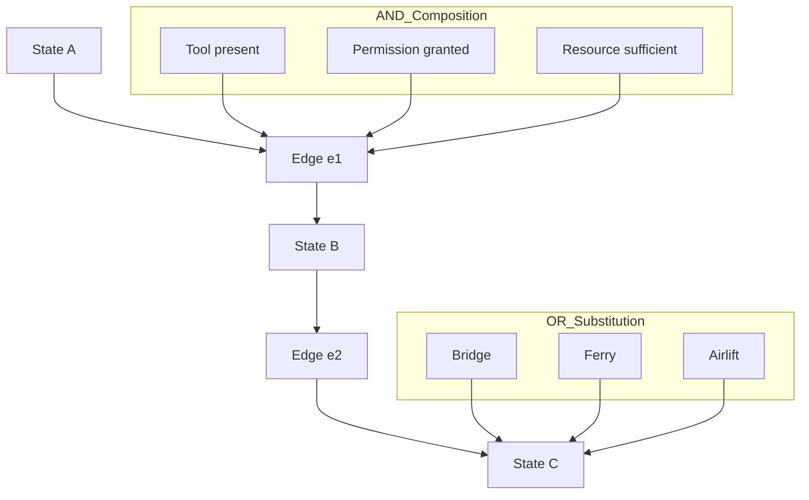
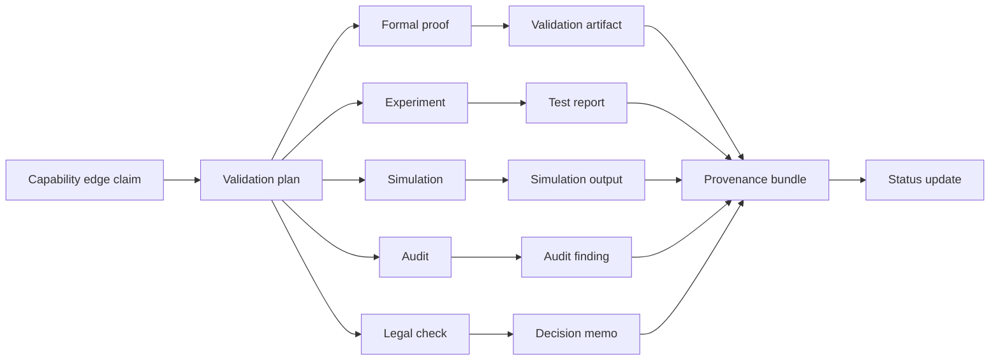

# Structural Capability Maps for Edge-Generating Frameworks

## Executive summary

Your framework’s strongest idea is that capability should be modeled as **edge generation under constraints**, not merely path search on a pre-given graph. In your own terms, capability is relational across agent, environment, infrastructure, tools, resources, permissions, and learned abstractions, and persistent organization is better described by constrained, weighted reachability than by static object inventories. That is a sound direction, and it aligns well with modern work on affordances, planning languages, provenance standards, and graph-based knowledge representation. Gibson-style affordances frame action availability as a relation between agent and environment; modern RL work makes the same point explicitly, treating affordances as state-dependent action availability that both narrows search and improves learned transition models. Your uploaded notes push this farther by treating admissible transformation structure, weighted reachability, and stable generators as primary explanatory objects rather than pre-enumerated states or objects. citeturn26view0turn26view2turn25view0turn26view3 fileciteturn0file14 fileciteturn0file9 fileciteturn0file10

The most concrete way to operationalize the framework is to build a **typed structural capability map** with six first-class layers: **states**, **transition edges**, **support carriers** such as agents and organizations, **enablers** such as resources/tools/infrastructure/permissions, **constraints** such as invariances and conservation laws, and **evidence/validation** with explicit provenance. For interchange and reasoning, the cleanest standards-aligned core is RDF plus SHACL plus PROV: RDF gives a graph of typed statements, SHACL gives machine-checkable structural constraints and logical composition such as `and` and `or`, and PROV gives interoperable modeling of entities, activities, agents, derivations, bundles, and provenance-of-provenance. citeturn2view3turn30view1turn30view0turn1view0turn2view5turn3view0

I recommend treating **invariances, symmetries, conservation laws, guard conditions, and impossibility constraints as first-class nodes**, not comments on edges. That is the main architectural move that will distinguish your system from ordinary workflow graphs. In physics, Noether’s framework makes the connection between continuous symmetries and conserved quantities foundational; in planning, action models need typed preconditions and effects; in socio-technical systems, safety depends on explicitly modeling controls, barriers, hidden couplings, and the conditions under which controls fail. A capability map that does not represent such constraints as graph objects will eventually collapse into a shallow task graph. citeturn26view4turn27search0turn25view0turn15view0turn29view1

The rest of this report gives a concrete schema, uncertainty model, validator workflow, failure taxonomy, visualization grammar, four cross-domain case studies, and a prototype roadmap.

## Design principles and map ontology

A useful structural capability map should answer five questions simultaneously:

1. **What state transformation is being claimed?**
2. **For whom or by what carrier is it claimed?**
3. **Under what supports and constraints does it hold?**
4. **How strong is the evidence and over what horizon does it remain reliable?**
5. **What harms, adversarial uses, or failure pathways are also opened by the same edge?**

That design directly fits your uploaded view that stable organization is best understood through weighted, constrained reachability, with boundaries defined by cost gradients and by conditions that preserve or break organization. fileciteturn0file9 fileciteturn0file10

The ontological core should distinguish **descriptive truth**, **operational validity**, and **situational availability**. An edge can be physically possible but not presently available; available but not permitted; permitted but unsafe; safe in nominal conditions but fragile under perturbation; or blocked except through substitution. Modern planning languages reinforce this separation by representing actions through typed preconditions, resources, temporal conditions, and effects rather than through loose adjacency lists. citeturn25view0

The graph should therefore use the following primary entity classes.

| Class | What it represents | Essential fields |
|---|---|---|
| **State** | A world configuration at a chosen abstraction level | `state_id`, `type`, `scope`, `time_window`, `description`, `abstraction_level` |
| **Edge** | A typed transition claim from source state to target state | `edge_id`, `source`, `target`, `edge_type`, `carrier_scope`, `preconditions`, `effects`, `hazards`, `status` |
| **Carrier** | The actor or substrate that traverses or realizes the edge | `carrier_id`, `kind`, `capability_profile`, `jurisdiction`, `trust_profile` |
| **Resource** | Consumable or reservable inputs | `resource_id`, `kind`, `quantity`, `unit`, `availability_window`, `replenishment_rule` |
| **Tool** | Instrumental enablers that modify admissible edges | `tool_id`, `class`, `operating_envelope`, `required_training`, `failure_modes` |
| **Infrastructure** | Durable environmental supports | `infra_id`, `class`, `capacity`, `coverage`, `maintenance_state` |
| **Permission** | Institutional or legal gates | `perm_id`, `issuer`, `scope`, `conditions`, `expiry`, `revocation_rule` |
| **Constraint** | Invariances, symmetries, conservation laws, physical bounds, policy constraints | `constraint_id`, `constraint_type`, `scope`, `formalization`, `violation_test`, `severity` |
| **Validator** | A method or institution that can test or certify an edge | `validator_id`, `kind`, `protocol`, `independence_level`, `applicability_domain` |
| **Evidence** | A concrete basis for belief in a map object | `evidence_id`, `evidence_type`, `artifact_ref`, `sample_scope`, `timestamp`, `quality_score` |
| **Provenance Bundle** | Full derivation history of a claim, including provenance-of-provenance | `bundle_id`, `generated_by`, `used`, `attributed_to`, `derived_from`, `version` |

This design is compatible with PROV’s distinction among **entities, activities, and agents**, its support for derivation and responsibility, and its explicit “bundle” mechanism for provenance of provenance. PROV was created precisely so heterogeneous systems could exchange provenance while preserving consistency and reasoning value. citeturn1view0turn2view5turn3view0

### Recommended representation strategy

For a production-grade implementation, I recommend a **dual representation**:

| Layer | Recommendation | Why |
|---|---|---|
| **Semantic interchange layer** | RDF / JSON-LD + PROV-O + domain ontology | Standardized, interoperable, queryable, inference-friendly. RDF graphs are sets of triples with well-defined logical meaning. PROV-O maps provenance to RDF. citeturn2view3turn2view5 |
| **Operational storage layer** | Labeled property graph or graph-native event store | Better ergonomics for traversal-heavy planning, UI editing, path search, and interactive simulation. RDF and property graphs are complementary tradeoffs rather than mutually exclusive stacks. citeturn26view3turn28academia0 |
| **Integrity layer** | SHACL shapes | Machine-checkable graph conformance, severities, result reports, logical `and` / `or` composition. citeturn30view1turn30view0turn2view2turn2view1 |
| **Evidence layer** | Object store + immutable artifact IDs + hash/version refs | Keeps raw experiments, logs, proofs, PDFs, videos, and simulation outputs outside the hot graph while leaving the graph as the index. |
| **Temporal change layer** | Append-only validation and update events | Preserves historical truth, rollback, and auditability. |

The map should be **multi-resolution**. Your own framework repeatedly emphasizes that useful abstraction is not maximal granularity but the ability to expand where reachability is uncertain or blocked. That suggests compressed nodes and edges by default, with staged expansion into fine-grained subgraphs only when validators fail, risks spike, or planning requires detail. fileciteturn0file14

### First-class constraints

The distinctive move is to make constraints first-class graph elements rather than edge annotations.



Each constraint object should specify:

| Constraint subtype | Typical semantics |
|---|---|
| **Invariant** | Quantity or relation preserved across allowed transformations |
| **Symmetry** | Equivalence class or transformation group under which some property is unchanged |
| **Conservation law** | Ledger-style accounting rule with zero net creation beyond defined sources/sinks |
| **Capacity bound** | Maximum load, rate, throughput, dosage, occupancy, or authority |
| **Compatibility rule** | Carrier-tool, tool-environment, or protocol-entity matching rule |
| **Jurisdiction rule** | What is allowed by place, role, or institutional status |
| **Hazard barrier** | Preventive or mitigative control that must remain intact |
| **Impossibility rule** | Hard prohibition or physically inadmissible transition |

This is where your “invariance before invariants” intuition becomes operational: a map must encode not just discovered invariants but also the **supporting symmetry/constraint structure** that makes them portable across domains. Noether’s original variational formulation is the right conceptual anchor here because it ties admissible transformation structure to the conservation properties that survive those transformations. citeturn26view4turn27search0 fileciteturn0file9

## Schema and composition model

### Minimal formal schema

A concise formal core can be written as:

```text
CapabilityMap M = (
  States S,
  Edges E,
  Carriers A,
  Resources R,
  Tools T,
  Infrastructure I,
  Permissions P,
  Constraints K,
  Validators V,
  Evidence X,
  Provenance B
)

e ∈ E :=
  (src: S, dst: S,
   type: EdgeType,
   carriers: A*,
   requires: ReqExpr,
   effects: EffExpr,
   constrained_by: K*,
   validated_by: ValidationSet,
   evidence: X*,
   risk: RiskVector,
   cost: CostVector,
   reliability: RelModel,
   horizon: HorizonModel,
   status: Status)
```

Where:

- `ReqExpr` is a typed Boolean expression over required supports.
- `EffExpr` is a typed effect expression over changed state variables.
- `CostVector` may include time, money, energy, coordination load, legal exposure, bio-risk, and opportunity cost.
- `RiskVector` should separate nominal failure, catastrophic failure, hidden harm, adversarial misuse, and externalized harm.
- `RelModel` captures both a point estimate and stability over context.
- `HorizonModel` states how long the edge claim remains expected to hold.
- `Status` is distinct from confidence: for example `draft`, `tested`, `certified`, `deprecated`, `blocked`.

### Edge-type taxonomy

I recommend the following edge taxonomy as native map labels.

| Edge type | Meaning | Typical decision rule |
|---|---|---|
| **possible** | Not ruled out by known hard constraints | At least one realizable witness is known or strongly plausible |
| **valid** | Formally or empirically admissible under stated conditions | Preconditions, carrier-match, and constraints satisfied |
| **available** | Realizable now with present supports | Required supports currently instantiated |
| **permitted** | Institutionally or legally authorized | Relevant permissions and jurisdiction checks passed |
| **safe** | Risk acceptable under current control regime | Hazard analysis below threshold and controls active |
| **fragile** | Works but with narrow margins or poor transfer | High sensitivity to context, drift, or perturbation |
| **imagined** | Hypothesized or design-stage only | No operational witness yet |
| **blocked** | Not currently traversable due to missing support or failing constraint | At least one hard blocker unresolved |
| **deprecated** | Formerly usable but should no longer be relied upon | Superseded, unsafe, unsupported, or policy-retired |
| **adversarial** | Edge exists primarily for misuse, exploitation, or attack paths | Achieves harmful or unauthorized state change |

These distinctions matter because capability claims are frequently conflated. The same transition may be **possible** but not **permitted**; **permitted** but not **safe**; **safe in lab conditions** but **fragile in production**; or **available to an organization** but not to an individual carrier. Your own notes explicitly separate possessed, delegated, and collective capability, which is exactly the right move here. fileciteturn0file14

### Composition rules

Composition should be typed and explicit, not implicit in path search. SHACL and planning formalisms give a useful precedent: conjunction and disjunction are first-class; conformance and validation are explicit; concurrency and temporal/resource conditions matter. citeturn30view1turn30view0turn25view0



Recommended operators:

| Operator | Semantics |
|---|---|
| **Serial composition** `e1 ; e2` | Output state of `e1` must satisfy input typing of `e2` |
| **Parallel composition** `e1 || e2` | Concurrent traversal allowed if resources and constraints do not conflict |
| **AND preconditions** | All listed supports must conform |
| **OR alternatives** | Any one support branch suffices |
| **XOR alternatives** | Exactly one admissible branch |
| **Guarded transition** | Edge active only when predicate over state/context is true |
| **Substitution** | Missing support replaced by equivalent or approximate support with changed cost/risk |
| **Delegation** | Carrier obligation transferred to another validated carrier |
| **Fallback / bailout** | Safe recovery edge when primary edge confidence collapses |

A practical rule for composition is:

```text
Composite edge confidence
  = function(
      component confidences,
      dependence structure,
      validator quality,
      context stability,
      weakest-link margins
    )
```

Do **not** multiply confidences naïvely unless independence is justified. For safety-critical maps, dependence assumptions should be explicit rather than hidden.

### Suggested SHACL-style logic for map linting

Use SHACL-like integrity rules to enforce basic graph quality:

- Every `safe` edge must reference at least one active hazard control.
- Every `permitted` edge must reference at least one permission object with jurisdiction and expiry.
- Every `available` edge must reference a current support witness.
- Every `certified` or `validated` edge must have at least one validation report and provenance bundle.
- Every `conservation` constraint must define ledger scope and allowed sources/sinks.
- Every `fragile` edge must include at least one sensitivity factor or failure trigger.

SHACL is particularly suitable because it already supports **conformance checking**, **validation reports**, **results graphs**, machine-readable **severity**, and logical **and/or** composition of shapes. citeturn30view2turn2view2turn2view1turn30view1turn30view0

## Uncertainty, validation, and failure mapping

### Uncertainty model

A capability map should not collapse uncertainty into one scalar. I recommend five separate uncertainty fields for every edge and constraint:

| Field | Meaning |
|---|---|
| **Belief score** | Current probability-like belief that the claim holds in scope |
| **Evidence strength** | How much and what quality of evidence supports the claim |
| **Context stability** | How sensitive the claim is to environment, carrier, or distribution shift |
| **Time horizon** | How long the claim is expected to hold before revalidation |
| **Validation status** | Draft, screened, tested, replicated, audited, certified, retired |

Evidence types should be explicit and typed:

| Evidence type | Typical strengths | Typical weaknesses |
|---|---|---|
| **Observation** | Real-world grounding, often cheap, covers existing operations | Confounding, hidden causes, weak counterfactual strength |
| **Experiment** | Strong causal evidence, can isolate intervention effects | May not transfer; may be narrow in scope |
| **Simulation** | Safe exploration of rare/high-cost states | Model risk, unvalidated assumptions |
| **Theory / proof** | Strong structural guarantees inside formal scope | Scope mismatch, omitted real-world conditions |
| **Audit / inspection** | Governance and compliance traceability | Often periodic, snapshot-based |
| **Expert judgment** | Useful where data are sparse | Subjective and often poorly calibrated |

That decomposition is preferable to one monolithic “confidence” because it lets you represent cases like “high theoretical validity but low deployment reliability” or “strong observational regularity but short time horizon.”

### Recommended update rule

For operational use, a simple **evidence accumulator** works well:

```text
posterior_log_odds(edge) =
    prior_log_odds
  + Σ(weight_evidence_type × quality × relevance × independence_factor × sign)

horizon_next =
    min(
      previous_horizon + confirmed_stability_gain,
      domain_max_horizon
    )
```

And a strict override rule should exist for hard failures:

```text
if hard_constraint_violated or catastrophic_hazard_detected:
    status := blocked
    safe := false
    confidence := sharply_downweighted
```

This is intentionally conservative. Safety-critical maps should degrade quickly under disconfirming evidence, especially when hidden harms or adversarial misuse emerge.

### Validation workflows

Validation should itself be represented as graph structure using PROV-style entities, activities, and agents.



Each validation activity should record:

| Field | Why it matters |
|---|---|
| `validator_kind` | Proof, experiment, simulation, audit, legal review |
| `protocol_version` | Reproducibility and drift tracking |
| `input_artifacts` | Exact models, datasets, instruments, policies, statutes |
| `executor` and `independence` | Internal, external, regulator, peer reviewer |
| `context` | Operating envelope, jurisdiction, subjects, time bounds |
| `result` | Pass, fail, partial, inconclusive |
| `severity` | Violation / warning / info analog |
| `confidence_delta` | How much the result should change belief |
| `next_review_date` | Horizon management |
| `derived_from` | Provenance chain to prior validations |

This is exactly the kind of thing PROV is designed for: provenance as a record of entities, activities, people, institutions, derivations, and even provenance-of-provenance. PROV constraints also matter because they define validity as a consistent history rather than merely arbitrary annotations, and SHACL allows validation reports to include additional provenance metadata. citeturn1view0turn3view0turn2view2

Independent validation is especially important for high-stakes software and AI capability claims. NASA’s IV&V program exists specifically to improve reliability, find defects earlier, reduce mission development cost, and mitigate operational risk in safety- and mission-critical software. NIST’s AI RMF likewise frames AI risk management as a trustworthiness problem affecting individuals, organizations, and society, and treats the framework as a voluntary but structured basis for design, development, use, and evaluation. citeturn15view0turn29view1turn29view2

### Failure modes, hidden harms, and adversarial edges

You asked for explicit support for adversarial and hidden-harm edges. These should be modeled as **negative capability edges**: transitions that are opened by the same support structure but lead to harmful, unauthorized, or externalized outcomes.

Minimum failure taxonomy:

| Failure class | What to record |
|---|---|
| **Precondition failure** | Which support was absent, stale, or mismatched |
| **Constraint violation** | Which invariant, conservation rule, or legal rule failed |
| **Carrier mismatch** | Wrong user, skill level, certification, or trust tier |
| **Resource exhaustion** | Fuel, time, money, attention, bandwidth, sterile stock, compute budget |
| **Control failure** | Safety barrier existed but failed, drifted, or was bypassed |
| **Distribution shift** | Validation no longer representative of current conditions |
| **Coordination failure** | Serially valid edges fail jointly because handoffs break |
| **Adversarial exploitation** | Edge becomes abuse path, privilege escalation, prompt-injection path, or sabotage path |
| **Hidden harm** | Goal reached but with untracked damage to third parties or downstream systems |
| **Deprecation drift** | Edge persists in map after tool, policy, environment, or institution changed |

Use **harm edges** from a primary edge to side-effect states and stakeholder-impact nodes. That keeps “success” from masking unsafe completion. This is where socio-technical safety concepts are useful: systems fail not only because components fail, but because controls, interfaces, incentives, and oversight structures are mis-specified or drift apart. citeturn15view0turn29view1

## Visualization and cross-domain case studies

### Recommended visual grammar

A good capability map should make the distinction between **can**, **may**, **have now**, **should**, and **ought not** visible at a glance.

| Visual channel | Recommended meaning |
|---|---|
| **Node border shape** | Entity type: state, constraint, validator, support, harm |
| **Edge color family** | Edge type: possible / available / permitted / safe / blocked / adversarial |
| **Edge width** | Reliability or empirical support |
| **Edge opacity** | Confidence or evidence sufficiency |
| **Edge dash pattern** | imagined, deprecated, or simulated-only |
| **Halo / glow** | Active in current operating context |
| **Lock icon** | Permission-gated |
| **Shield icon** | Safety-controlled |
| **Triangle warning** | Fragile or hidden-harm risk |
| **Clock badge** | Horizon expiry / revalidation due |
| **Ledger badge** | Conservation or accounting constraint attached |

The map should also have switchable layers:

- **Structural layer**: states and transitions.
- **Support layer**: tools, resources, infrastructure, permissions.
- **Constraint layer**: invariants, conservation laws, hazards, barriers.
- **Evidence layer**: validators, reports, confidence, provenance.
- **Governance layer**: owners, reviewers, expiry, deprecations.

### Template case studies

The following are **illustrative construction templates**, not empirical performance claims.

#### Physical mobility

Goal: `home_city -> island_destination_without_private_aircraft`

| Element | Example encoding |
|---|---|
| Source state | `person_at_terminal_city` |
| Target state | `person_on_island` |
| Candidate edges | `drive_to_port`, `board_ferry`, `bike_on_bridge`, `charter_boat` |
| Supports | vehicle, ticket, schedule, weather window, ID, fuel |
| Constraints | load limits, weather safety minima, border rules, conservation of fuel/time budget |
| Validators | schedule confirmation, weather check, ticket validation, route legality |
| Confidence note | High for ferry route when schedule current; low for improvised water crossing |
| Hidden-harm edge | `unsafe_sea_crossing -> injury/loss` |

This case fits your framework directly: the destination is not meaningfully reachable by “search” until the map represents the carrier, infrastructure, permissions, and environmental conditions that generate the edge in the first place. fileciteturn0file14

#### Surgery

Goal: `indicated_patient -> completed_safe_operation`

| Element | Example encoding |
|---|---|
| Source state | `patient_preop_ready` |
| Target state | `patient_postop_stable` |
| Candidate edge | `perform_laparoscopic_procedure` |
| Supports | licensed surgeon, anesthesia, sterile instruments, OR, consent, imaging, postoperative care |
| Constraints | anatomy, sterile processing rules, dose/bleeding limits, wrong-site prevention, time-critical physiological bounds |
| Validators | checklist completion, equipment counts, sterilization records, team time-out, audit logs |
| Confidence note | Edge is valid only if sterile, consent, staffing, and critical safety controls all conform |
| Hidden-harm edge | `retained_item`, `wrong-site surgery`, `infection`, `bile duct injury` |

WHO’s surgical safety work makes the validation logic here concrete: structured checklists and phase-based verification are not mere bureaucracy; they are edge-stabilizing controls in a socio-technical system. Evidence summarized in the literature reports substantial reductions in complications and mortality after checklist implementation, though implementation quality matters. citeturn11search2

#### AI capability

Goal: `base_model -> reliable_domain_specific_agent`

| Element | Example encoding |
|---|---|
| Source state | `foundation_model_available` |
| Target state | `deployed_agent_with_bounded_use_case` |
| Candidate edges | `tool_enablement`, `retrieval_attachment`, `policy_wrap`, `fine_tune`, `sandbox_execute` |
| Supports | APIs, vector store, tool schema, evaluation harness, runtime controls, operator oversight |
| Constraints | policy limits, latency budget, context limits, privacy rules, adversarial prompt boundaries |
| Validators | benchmark suite, red-team test, model card, human audit, production monitoring |
| Confidence note | Separate capability confidence from safety confidence and deployment confidence |
| Hidden-harm edge | `tool misuse`, `prompt injection`, `privacy leak`, `autonomous error cascade` |

This case is where model cards and NIST AI RMF are especially useful. Model cards argue that deployed models should carry documented intended uses, evaluation procedures, performance characteristics, and limitations; NIST frames ontology, documentation, evaluation, and risk management as central to trustworthy AI. citeturn25view1turn29view1

#### Institutional access

Goal: `analyst_without_access -> analyst_using_restricted_dataset`

| Element | Example encoding |
|---|---|
| Source state | `analyst_request_submitted` |
| Target state | `approved_access_active` |
| Candidate edges | `employment_verification`, `training_complete`, `NDA_signed`, `IRB_or_policy_clearance`, `account_provisioning` |
| Supports | sponsor, manager approval, security training, legal review, secure workspace |
| Constraints | jurisdiction, role-based access, data minimization, audit logging, time-limited authorization |
| Validators | HR verification, legal check, IAM audit, security review |
| Confidence note | Usually high on permission logic, lower on whether access will remain continuously available |
| Hidden-harm edge | `overbroad permissions`, `shadow sharing`, `data exfiltration`, `policy drift` |

This case is especially valuable because it shows why **permissions and validators** must be first-class map elements rather than metadata tags.

### Alternative representation comparison

| Representation | Strengths | Weaknesses | Best use |
|---|---|---|---|
| **Property graph only** | Fast traversal, ergonomic editing, easy UI reasoning | Weaker semantic interoperability; provenance and statement-level semantics often ad hoc | Interactive planning, operations consoles |
| **RDF + SHACL + PROV only** | Standardized semantics, interchange, schema shapes, provenance rigor | More cumbersome for tactical traversal and UI-centric editing | Canonical registry, governance, interchange |
| **Hybrid RDF + property graph** | Best balance of semantics and operations | More implementation complexity | Recommended default |
| **Hypergraph / n-ary event model** | Natural for multi-party transitions and rich preconditions | Harder tooling ecosystem | Complex scientific, institutional, or multi-agent workflows |
| **Process algebra / Petri net overlay** | Excellent for concurrency and resource flow | Can become abstract and difficult for end users | High-rigor execution and simulation backends |

Knowledge-graph literature highlights schema, identity, and context as central concerns, which is exactly why a hybrid representation is attractive here: you need the semantics of a knowledge graph and the ergonomics of a traversal graph. citeturn26view3turn28academia0

## Prototyping, evaluation, and prioritized references

### Prototype roadmap

I would prototype in four passes.

**Pass one** should build the **canonical ontology**: state, edge, carrier, support, constraint, validator, evidence, provenance bundle, and harm edge. Implement only a small core of statuses and edge types, but make constraints first-class from day one.

**Pass two** should build a **map compiler / linter**:
- SHACL conformance checks for structural integrity.
- Rule engine for derived statuses such as `available`, `permitted`, and `safe`.
- Provenance logging for every edge assertion and validation update.
- Time-based invalidation of stale permissions, tests, or evidence. citeturn30view2turn2view2turn3view0

**Pass three** should build **interactive views**:
- layered graph explorer,
- on-demand expansion of compressed edges,
- scenario toggles by carrier or jurisdiction,
- confidence and horizon overlays,
- failure and adversarial-path explorer.

**Pass four** should build **evaluation loops**:
- compare predicted vs realized reachability,
- compare nominal vs failure-path discovery,
- track edge drift after environment or policy changes,
- benchmark analyst agreement on the same map.

### Recommended metrics

| Metric | Definition | Why it matters |
|---|---|---|
| **Edge precision** | Fraction of asserted edges that survive validation | Prevents fantasy-graph inflation |
| **Edge recall** | Fraction of actually realizable edges represented | Measures blind spots |
| **Support completeness** | Fraction of edges with all required support classes linked | Tests whether maps are structurally actionable |
| **Constraint coverage** | Fraction of high-impact edges with explicit constraints | Prevents shallow “task graph” failure |
| **Validation depth** | Mean number and diversity of validators per high-risk edge | Measures epistemic robustness |
| **Provenance completeness** | Fraction of claims with full derivation trace | Supports auditability and trust |
| **Drift latency** | Time from real-world change to map update | Measures operational freshness |
| **Failure discoverability** | Fraction of historical or simulated failures whose path exists in map | Tests safety usefulness |
| **Harm visibility** | Fraction of goal edges with explicit side-effect/harm modeling | Prevents success bias |
| **Inter-rater map agreement** | Agreement across experts building maps from same domain | Measures ontology clarity |
| **Compositional validity** | Fraction of composed plans whose prerequisites/effects type-check | Tests map algebra |
| **Transfer utility** | Improvement when abstractions learned in one domain accelerate map building in another | Directly tests your transfer thesis |

### Recommended next steps

The highest-value next steps are not more philosophical elaboration. They are:

- Build a **minimal kernel** with about ten entity classes and ten edge types.
- Encode the four case studies above end-to-end.
- Add a **constraint ledger** for conservation and capacity rules.
- Add a **validation ledger** using PROV-like bundles.
- Define one **confidence policy** and one **deprecation policy** up front.
- Run a small expert exercise: have two or three people independently map the same domain and compare agreement, missing harms, and edge drift.

That sequence will tell you very quickly whether the framework stays crisp under implementation or dissolves into a fuzzy collection of annotations.

### Prioritized references

The most practically useful references for this framework are these.

**Official standards and reference architectures**

- W3C **PROV-DM** and **PROV-O** for provenance entities, activities, agents, derivations, bundles, and interoperable provenance exchange. citeturn1view0turn2view5
- W3C **PROV Constraints** for validity, normalization, consistency checking, and equivalence of provenance histories. citeturn3view0
- W3C **RDF 1.1 Concepts** for the graph data model and formal statement semantics. citeturn2view3
- W3C **SHACL** for logical shape constraints, conformance checking, severities, and validation reports. citeturn30view2turn30view1turn30view0turn2view2turn2view1
- NIST **AI Risk Management Framework** for trustworthiness-oriented risk management and evaluation in AI systems. citeturn29view1turn29view2

**Seminal and primary literature**

- Emmy Noether, **Invariant Variation Problems** for the foundational link between transformation symmetries and conserved structure. citeturn26view4turn26view6
- James J. Gibson’s affordance tradition, with a modern planning-compatible treatment in Khetarpal et al., **A Theory of Affordances in Reinforcement Learning**, which explicitly frames affordances as state-dependent feasible actions useful for planning and transition modeling. citeturn26view0turn26view2
- Fox and Long, **PDDL2.1**, for typed preconditions, effects, temporal and numeric resources, and validation of concurrent plans. citeturn25view0
- Hogan et al., **Knowledge Graphs**, for schema, identity, context, and quality considerations in graph-structured knowledge systems. citeturn26view3
- Mitchell et al., **Model Cards for Model Reporting**, for documenting intended use, evaluation procedures, disaggregated performance, and deployment limitations. citeturn25view1

**Socio-technical and domain validation exemplars**

- NASA **IV&V Program** as a model of independent validation for mission-critical software in a high-stakes socio-technical environment. citeturn15view0
- WHO surgical safety literature as a model of phase-based, checklist-mediated validation in a high-risk institutional workflow. citeturn11search2

**Your uploaded framework texts as direct conceptual antecedents**

- **Edge-Generating Capability Graphs** for the central claim that systems become more capable by generating edges, not merely by searching them. fileciteturn0file14
- **Constrained Generative Reachability** and **Constrained Generative Closure** for the shift from objecthood to weighted admissible transformation space and stable generators. fileciteturn0file9 fileciteturn0file10
- **Language as Projection** for keeping linguistic descriptions distinct from the underlying structural map while still modeling language as operational infrastructure where recognition regimes matter. fileciteturn0file13

## Open questions and limitations

Two issues remain genuinely open.

First, the framework still needs a crisp rule for **abstraction boundary selection**: when should a compressed edge remain atomic, and when must it expand into substructure? Your notes point toward “expand on failure or uncertainty,” which is good, but the operational trigger thresholds still need formalization. fileciteturn0file14

Second, there is no universally correct way to aggregate uncertainty across mixed evidence types, dependent validators, and socio-technical drift. The report therefore recommends a conservative, typed uncertainty model rather than claiming a single solved calculus. That is a limitation, but it is also the right design choice at prototype stage.